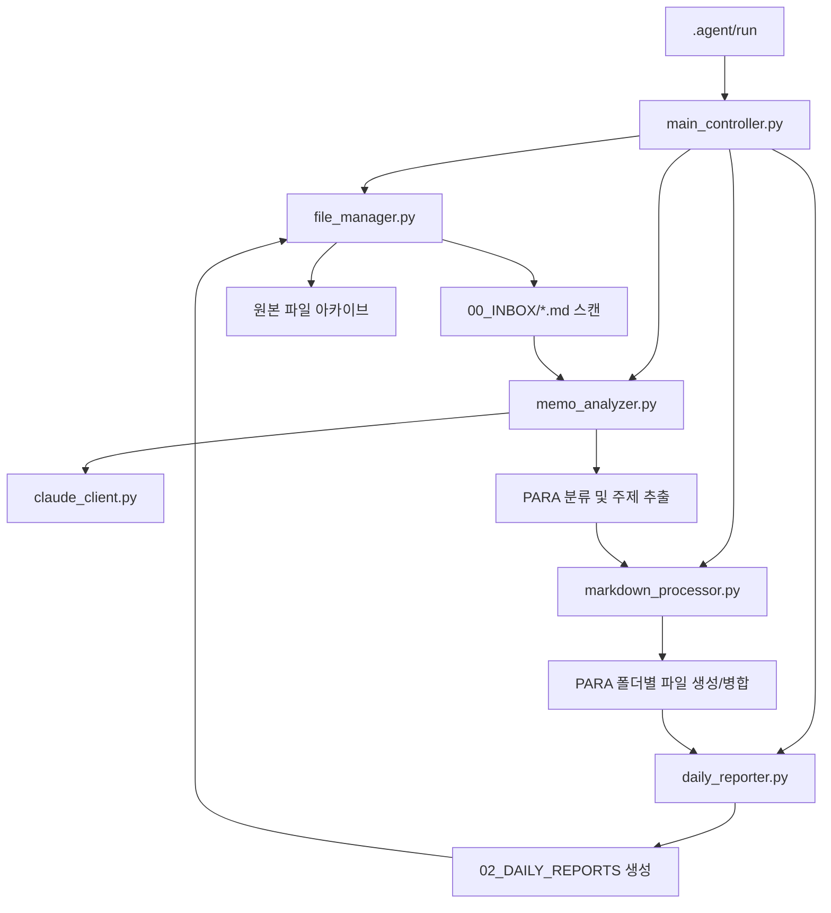

# 📋 Obsidian 메모 분석 에이전트 - 모듈 구조 (v2.0 PARA)

## 🗂️ 파일 구조

```
📁 프로젝트 루트/
├── 00_INBOX/              # 📥 입력: 원본 메모 파일 (_ARCHIVED 포함)
├── 01_AGENDAS/            # 📋 출력: PARA로 분류된 의제 파일
│   ├── Projects/          # 🎯 마감일이 있는 프로젝트
│   └── Areas/             # 🏢 지속적인 책임 영역
├── 02_DAILY_REPORTS/      # 📊 일일 요약 보고서
└── 🤖 .agent/             # 🛠️ 에이전트 패키지 (격리된 시스템)
    ├── bin/               # 핵심 실행 모듈
    │   ├── main_controller.py     # 메인 오케스트레이터
    │   ├── claude_client.py       # AI API 연동
    │   ├── file_manager.py        # PARA 인식 파일 I/O
    │   ├── memo_analyzer.py       # AI 분석 + PARA 분류
    │   ├── markdown_processor.py  # 마크다운 처리 및 병합
    │   └── daily_reporter.py      # 일일 통계 보고서
    ├── config/            # 외부 설정 (rules.json)
    ├── logs/              # 일일 활동 로그
    └── run                # 시스템 진입점 스크립트
```

## 🧩 모듈별 책임

### 1. **main_controller.py** - 시스템 오케스트레이터
- **역할**: 경로 매개변수 기반의 전체 워크플로우 제어 및 PARA 방법론 통합
- **주요 기능**:
  - 볼트 경로(Vault Path) 매개변수화 처리
  - 모듈 간 의존성 주입 및 실행 순서 관리
  - PARA 분류 결과에 따른 지능형 라우팅

### 2. **claude_client.py** - AI 클라이언트
- **역할**: `claude` CLI를 통한 AI API 호출 및 비용 추적
- **주요 기능**:
  - Claude Code CLI 연동 및 안정적인 응답 획득
  - 구조화된 JSON 응답 포맷팅 및 타임아웃 처리
  - 토큰 사용량 기반의 비용 추적(Cost Tracking)

### 3. **file_manager.py** - PARA 기반 파일 관리
- **역할**: PARA 디렉토리 구조 지원 및 원자적(Atomic) 파일 작업
- **주요 기능**:
  - `Projects`와 `Areas` 폴더 관리 및 경로 탐색
  - **원자적 쓰기 패턴**: 백업 생성 -> 쓰기 -> 성공 시 삭제/실패 시 복구
  - 안전한 파일 아카이빙 및 경로 정규화

### 4. **memo_analyzer.py** - 지능형 분석 엔진
- **역할**: AI를 통한 다중 주제 추출 및 PARA 자동 분류
- **주요 기능**:
  - `rules.json` 기반의 키워드 분석 및 분류
  - 다단계 JSON 파싱 및 정규표현식 기반 복구 로직
  - 업무(Tasks) 자동 추출 및 요약 생성

### 5. **markdown_processor.py** - 마크다운 처리
- **역할**: 지능형 마크다운 병합 및 중복 제거
- **주요 기능**:
  - 섹션 기반 파싱 (할 일 목록, 메모 이력)
  - 기존 할 일과의 중복 제거 및 스마트 병합
  - 타임스탬프 기반의 메모 이력(History) 보존

### 6. **daily_reporter.py** - 일일 통계 보고서
- **역할**: PARA 처리 통계 및 일일 요약 생성
- **주요 기능**:
  - 프로젝트/영역별 처리 현황 요약
  - Obsidian 내부 링크(`[[ ]]`)를 포함한 리포트 생성
  - 처리 통계(주제 수, 할 일 개수 등) 테이블화

## 🔄 워크플로우



## 🚀 사용법

### 기본 실행 (전체 파이프라인)
```bash
./.agent/run /path/to/vault
```

### 분석 전용 (읽기 전용 모드)
```bash
./.agent/run /path/to/vault --analysis-only
```

### 특정 날짜 처리 및 JSON 출력
```bash
./.agent/run /path/to/vault --date 2026-03-07 --json
```

## 📊 처리 결과

### 입력
- `00_INBOX/*.md` (구조화되지 않은 모든 메모)

### 출력
1. **PARA 분류 의제**: `01_AGENDAS/Projects/` 또는 `Areas/`
   - **Projects**: 마감일이나 특정 목표가 있는 주제
   - **Areas**: 지속적인 업데이트가 필요한 책임 영역
2. **일일 요약 보고서**: `02_DAILY_REPORTS/Daily_Report_YYYY-MM-DD.md`
   - PARA 통계 정보 및 처리된 주제 목록
3. **아카이브**: `00_INBOX/_ARCHIVED/`
   - 타임스탬프가 포함된 원본 파일 보관

## 🎯 주요 개선사항

### v1.0 (기존) vs v2.0 (현재)

| 항목 | v1.0 (레거시) | v2.0 (PARA 시스템) |
|------|------|-------------|
| **시스템 구조** | 루트 디렉토리 혼합 | `.agent/` 패키지 격리 |
| **분류 방식** | 단일 디렉토리 저장 | PARA 방법론 (Projects/Areas) |
| **설정 관리** | 코드 내 하드코딩 | `rules.json` 외부 설정 지원 |
| **데이터 안전성** | 일반 덮어쓰기 | 원자적 쓰기 (Atomic Write) |
| **통계 보고** | 단순 리스트 생성 | PARA 기반 심층 분석 리포트 |
| **실행 방식** | python 스크립트 직접 호출 | 전용 진입점 스크립트 (`run`) |

## 🔧 확장 가능성

- **rules.json**: 코드 수정 없이 분류 키워드 및 작업 추출 규칙 변경 가능
- **claude_client.py**: 비용 최적화 및 타 AI 모델로의 전환 용이
- **markdown_processor.py**: 사용자 정의 템플릿 및 스타일 적용 가능
- **daily_reporter.py**: 주간/월간 단위의 대시보드 리포트로 확장 가능

## 💡 개발자 가이드

1. **격리 원칙**: 모든 시스템 로직은 `.agent/` 내부에 위치하며 볼트 데이터와 분리됨
2. **경로 매개변수화**: 모든 파일 작업은 볼트 루트 경로를 기준으로 상대 경로 처리
3. **방어적 프로그래밍**: API 실패나 JSON 파싱 오류 시 단계적 성능 저하(Graceful Degradation) 적용
4. **로깅**: `logs/` 폴더에 일일 단위로 상세 실행 이력 기록
