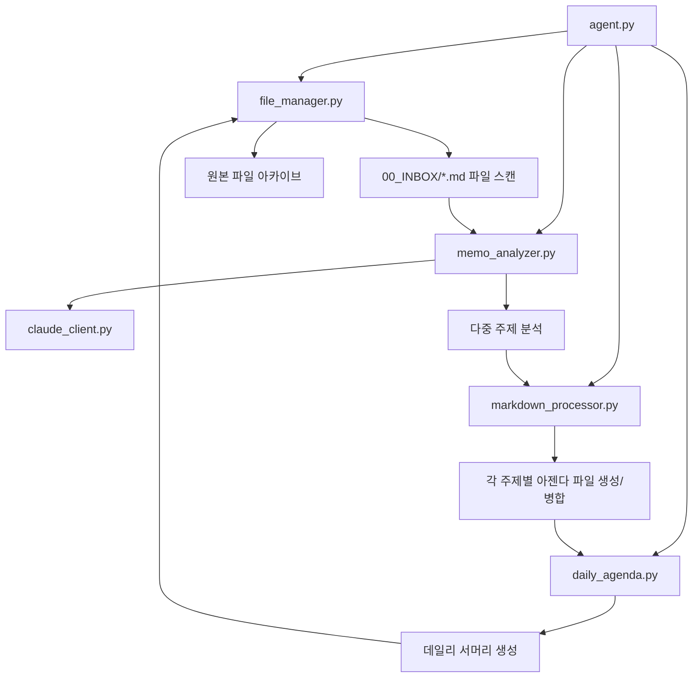

# 📋 Obsidian 메모 분석 에이전트 - 모듈 구조

## 🗂️ 파일 구조

```
📁 프로젝트 루트/
├── 🤖 agent.py                 # 메인 실행 파일 (AgentController)
├── ☁️ claude_client.py         # Claude Code CLI 클라이언트
├── 📁 file_manager.py          # 파일 I/O 관리
├── 🔍 memo_analyzer.py         # 메모 분석 (AI 호출)
├── 📝 markdown_processor.py    # 마크다운 처리 및 병합
├── 📅 daily_agenda.py          # 데일리 아젠다 생성
└── 📚 agent_old.py            # 기존 단일 파일 (백업용)
```

## 🧩 모듈별 책임

### 1. **agent.py** - 메인 컨트롤러
- **클래스**: `AgentController`
- **역할**: 전체 워크플로우 제어 및 모듈 조합
- **주요 기능**:
  - 모든 모듈 초기화
  - 파일 분석 및 병합 워크플로우 관리
  - 결과 출력 및 통계 표시
  - 명령행 인터페이스 제공

### 2. **claude_client.py** - AI 클라이언트
- **클래스**: `ClaudeClient`
- **역할**: Claude Code CLI를 통한 AI API 호출
- **주요 기능**:
  - Claude Code CLI 연결 확인
  - AI API 호출 및 응답 처리
  - 에러 핸들링 및 재시도 로직

### 3. **file_manager.py** - 파일 관리
- **클래스**: `FileManager`
- **역할**: 모든 파일 I/O 작업 담당
- **주요 기능**:
  - .md 파일 목록 수집 (00_INBOX)
  - 파일 읽기/쓰기
  - 파일 아카이브 (_ARCHIVED 폴더로 이동)
  - 파일명 정규화 (주제 → 파일명)

### 4. **memo_analyzer.py** - 메모 분석
- **클래스**: `MemoAnalyzer`
- **역할**: AI를 통한 메모 내용 분석
- **주요 기능**:
  - 다중 주제 추출 (Multi-Topic)
  - 업무/의사결정 관련 내용 필터링
  - 할 일 목록 및 요약 생성
  - JSON 형식 응답 파싱

### 5. **markdown_processor.py** - 마크다운 처리
- **클래스**: `MarkdownProcessor`
- **역할**: 마크다운 파일 구조 처리
- **주요 기능**:
  - 마크다운 섹션 파싱 (할 일 목록, 메모 이력)
  - 기존 할 일 목록 추출
  - 새 아젠다 파일 생성
  - 기존 파일과의 스마트 병합

### 6. **daily_agenda.py** - 데일리 아젠다
- **클래스**: `DailyAgendaManager`
- **역할**: 일일 처리 내용 요약
- **주요 기능**:
  - 처리된 주제들 수집 및 정리
  - 마크다운 링크 형태의 서머리 생성
  - Daily_Agenda_YYYY-MM-DD.md 파일 생성
  - 통계 정보 포함 (주제 수, 할 일 개수 등)

## 🔄 워크플로우



## 🚀 사용법

### 기본 실행 (분석 + 병합)
```bash
python3 agent.py
```

### 분석만 수행
```bash
python3 agent.py --analysis-only
```

### JSON 결과 출력
```bash
python3 agent.py --json
```

## 📊 처리 결과

### 입력
- `00_INBOX/*.md` 파일들

### 출력
1. **주제별 아젠다 파일들**: `01_AGENDAS/{주제}.md`
   - 할 일 목록 (기존과 중복 제거 후 병합)
   - 메모 이력 (날짜별 누적)

2. **데일리 서머리**: `01_AGENDAS/Daily_Agenda_YYYY-MM-DD.md`
   - 오늘 처리된 모든 주제 목록
   - 마크다운 링크 `[[주제]]` 형태
   - 처리 통계 (주제 수, 할 일 개수 등)

3. **아카이브**: `00_INBOX/_ARCHIVED/`
   - 처리 완료된 원본 파일들 (타임스탬프 포함)

## 🎯 주요 개선사항

### 기존 (단일 파일) vs 새 버전 (모듈화)

| 항목 | 기존 | 모듈화 버전 |
|------|------|-------------|
| **주제 처리** | 파일당 1개 주제 | 파일당 다중 주제 |
| **파일 구조** | 단일 파일 (577줄) | 6개 모듈 (평균 60줄) |
| **유지보수** | 어려움 | 쉬움 (기능별 분리) |
| **확장성** | 제한적 | 높음 (모듈별 독립 개발) |
| **테스트** | 전체 테스트 필요 | 모듈별 개별 테스트 |
| **데일리 서머리** | 없음 | 자동 생성 |
| **노이즈 필터링** | 기본 | 강화됨 |

## 🔧 확장 가능성

각 모듈이 독립적이므로 다음과 같은 확장이 용이합니다:

- **claude_client.py**: 다른 AI API 추가 (OpenAI, Gemini 등)
- **file_manager.py**: 다양한 파일 형식 지원 (.txt, .docx 등)
- **memo_analyzer.py**: 분석 모델 변경 또는 커스텀 프롬프트
- **markdown_processor.py**: 템플릿 커스터마이징
- **daily_agenda.py**: 주간/월간 서머리 추가

## 💡 개발자 가이드

새로운 기능을 추가하거나 수정할 때:

1. **단일 책임 원칙**: 각 모듈은 하나의 명확한 역할만 담당
2. **모듈 간 의존성 최소화**: 필요한 경우만 다른 모듈 import
3. **에러 핸들링**: 각 모듈에서 적절한 예외 처리
4. **로깅**: 사용자에게 명확한 진행 상황 표시
5. **테스트**: 모듈별로 독립 테스트 가능하도록 설계